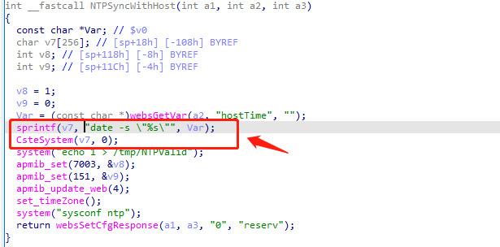
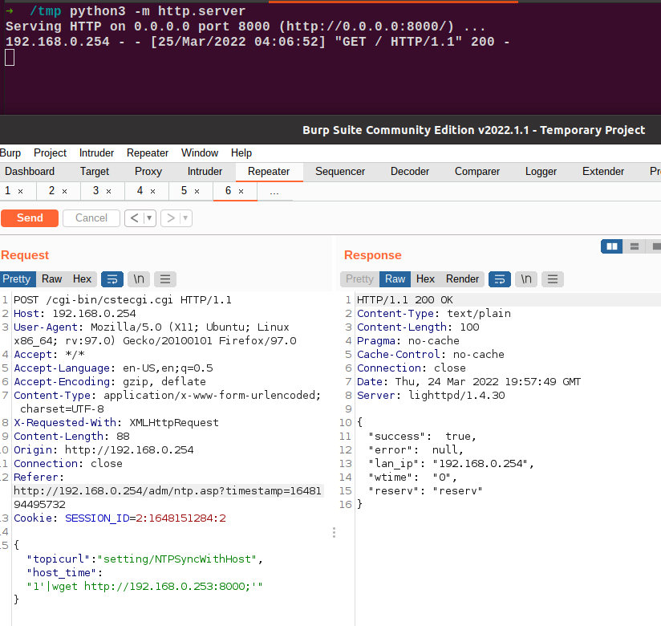

# TOTOLINK 漏洞

Vendor:TOTOLINK

Product:CP300+

Version:CP300+V5.2cu.7594_B20200910

Link:http://www.totolink.cn/

Discoverer:谢强

Type: 任意命令执行

## 漏洞描述

我们在TOTOLINK Technology无线AP中发现了一个命令注入漏洞，该漏洞包含最近发布的固件，允许远程攻击者根据精心编制的请求执行任意OS命令。

### Remote Command Execution

在system.so二进制文件中：

在NTPSyncWithHost函数中，**hostTime**由攻击者直接密码传递，因此我们可以控制**hostTime**来攻击设备。
正如您所看到的，在NTPSyncWithHost函数中，输入未被检查，初始输入将被提取并导致任意命令执行。

 

## POC

 
